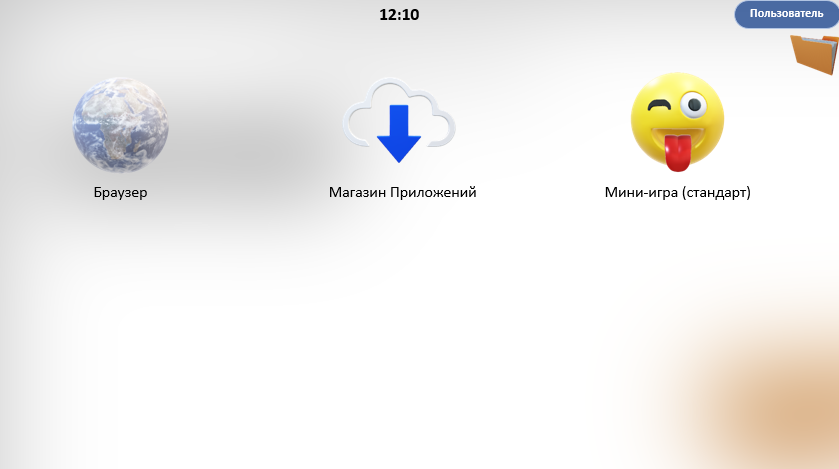
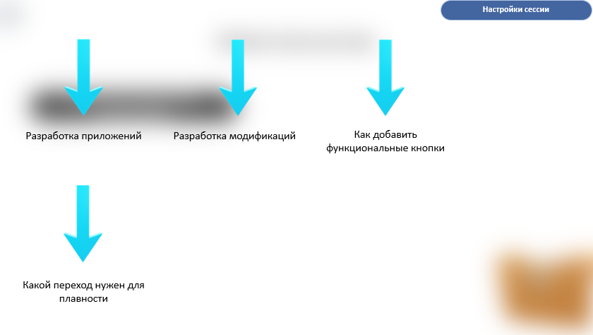
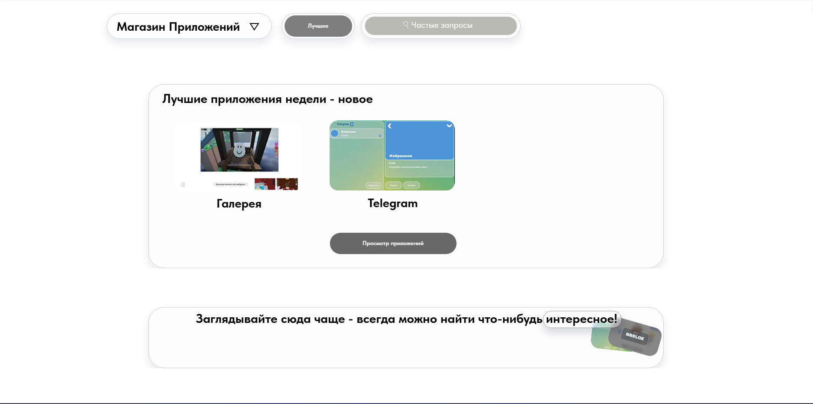

# 🖥️ ГлавнаяОС
> Операционная Система на основе PowerPoint (2024). Это трудно назвать полноценной системой, но возможно скоро проект станет полноценной графической оболочкой в виде `.exe` файла!

---

## 🚀 Основные ссылки проекта

### 🇷🇺 [ГлавнаяОС — Русская версия (Визуализация установки)](https://drive.google.com/drive/folders/1Ny-0ZSp0z1u96j_jwGNfinnpD4AWd3as)
* Нажмите на главное изображение выше или на эту ссылку, чтобы скачать русскую версию.

### 🌐 [MainOS — Global Version](https://towerrl.tilda.ws/page-not-found)
* Глобальная версия операционной системы для международных пользователей.

### 📦 [Необходимый софт: PowerPoint 2024](https://drive.google.com/drive/folders/1OSsrKDExE1cBd2sQ-6K58yL2b8JbvZTM)
* Версия PowerPoint, оптимизированная для корректной работы всех функций системы.

---

## 🛠️ Модифицируйте и кастомизируйте!
Модифицируйте систему под себя: создавайте уникальные моды, визуальные стили и свои собственные фишки!

➡️ **[Смотреть доступные модификации](https://drive.google.com/drive/folders/1OxkTPfXkHCEdbCfiKLWK-rATnWo0mQZf)**

---

## 🏪 Магазин приложений (App Store)
В нашем Магазине содержатся приложения, которые прошли строгую верификацию на отсутствие вирусов и безопасность макросов. 

💡 **Хотите сделать своё приложение?** Вы можете опубликовать свою работу! Главное условие — размер файла не должен превышать **2.5 GB**.

### 🔗 Быстрые переходы:
* 🛒 **[Перейти в Магазин Приложений](https://towerrl.tilda.ws/appstoremainos)**
* 👨‍💻 **[Портал для разработчиков (Devs)](https://towerrl.tilda.ws/devs)**

---

   
  <i>Возникли вопросы или идеи? Создайте Issue в этом репозитории!</i>

